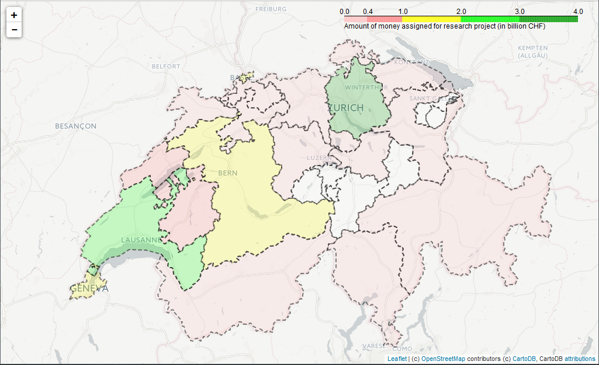

#03 - Interactive Viz

Explanation of the different files presented in this homework

### University\_to\_Canton.ipynb
Contains all the process followed to link each university to its canton. Create a `canton` dictionnary containting all the universities in each canton

### Map\_Vizualization.ipynb
Contains first the process to sum all the money assigned to each project, and link it to the dedicated canton. Provide then a vizualization of the distribution of the research money in Switzerland

### unimap.py
helper for uni\_to\_canton.ipynb

### sum_money.py
helper for Map\_Vizualization.ipynb.

## Final map result

As github seems to have difficulties to display folium map inside a iPy notebook, we provided here a .png screenshot what our Swiss map looks like.
You can generate it by cloning localy the notebook `Map_Vizualization.ipynb`

The color scale is directly shown in the picture of the map, so we don't add it here.

